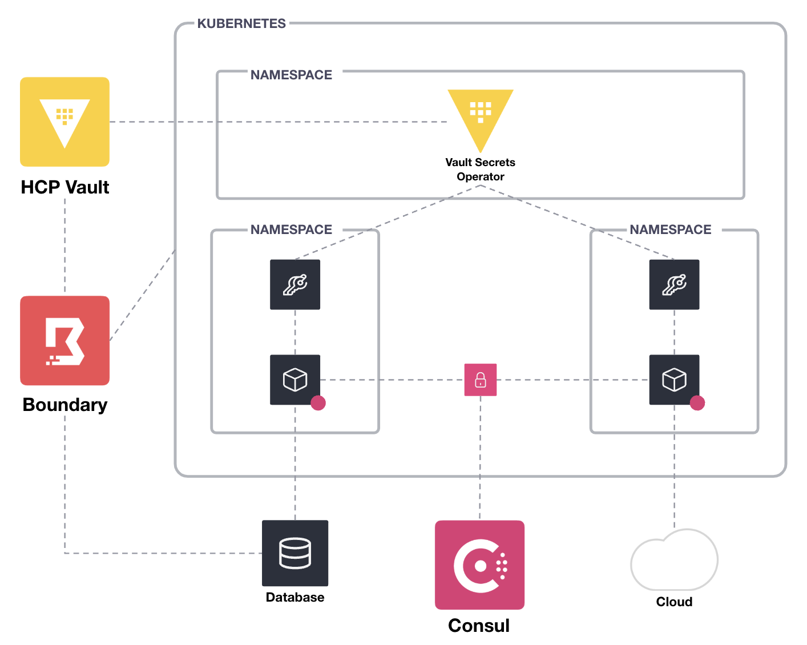

# hashistack-demo
This repository provides a demo of HashiCorp Terraform, Vault, Consul, and Boundary.

## Outline

- Baseline
  - Deploy K8s/RDS with Terraform
  - Consumption (HelloWorld + K8s Secret)
  - Consumption (SVC1 -> SVC2)

- Secure Secrets
  - Setup HCP Vault
    - Kubernetes auth method
  - Deploy Vault Secrets Operator on K8s
    - Static Secrets
      - KVV2 secrets engine
      - Consumption (HelloWorld + VaultStaticSecret)
    - Dynamic Secrets
      - Database secrets engine
      - Consumption (HelloWorld + VaultDynamicSecret)
  - Deploy Vault Agent Injector on K8s
    - Consumption (HelloWorld + Vault Agent/Proxy)

- Secure Communication
  - Deploy external Consul cluster with Terraform
  - Deploy Consul clients on K8s
    - Consumption (SVC1 -> SVC2 + mTLS)

- Secure Remote Access
  - Deploy Boundary with Terraform
  - Configure Vault/Boundary/Kubernetes
    - Consumption (secure kubectl access)
  - Configure Vault/Boundary/RDS
    - Consumption (secure postgres access)
  - Configure Vault/Boundary/VM
    - Consumption (secure ssh access)

## Diagram

  

